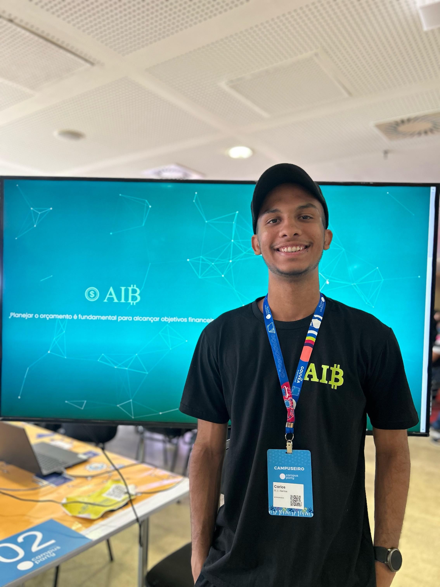

# Hub de Conexões do [@dev_inojoza_](https://inojoza28.github.io/conexoes)

Bem-vindo(a)! Este repositório contém um projeto simples e elegante para criar um **hub pessoal de conexões** com suas principais redes sociais, projetos, links de contato e outras informações relevantes. A proposta é ter uma página única, responsiva e personalizável para facilitar o compartilhamento de seus links em qualquer lugar.

---

## Índice
- [Visão Geral](#visão-geral)
- [Demonstração](#demonstração)
- [Recursos Principais](#recursos-principais)
- [Como Utilizar](#como-utilizar)
- [Personalização](#personalização)
- [Estrutura de Pastas](#estrutura-de-pastas)
- [Tecnologias Empregadas](#tecnologias-empregadas)
- [Contribuindo](#contribuindo)
- [Licença](#licença)
- [Autor](#autor)

---

## Visão Geral
Este projeto foi criado para servir como uma **landing page** pessoal onde você pode:

- Reunir links profissionais, redes sociais e contatos em um só lugar.
- Destacar seu perfil e suas habilidades de forma simples e agradável.
- Ter um modo claro/escuro (toggle de tema) integrado.
- Exibir um _Skill Map_ (mapa de competências) para direcionar as pessoas aos seus principais projetos, repositórios ou portfólio.

A página é **leve**, utiliza poucas dependências externas e foi desenvolvida para ser **fácil de customizar**.

---

## Demonstração
Ao abrir o arquivo `index.html` em seu navegador, você verá:

- Um **header** com partículas animadas ao fundo (via `particles.js`).
- Seu nome exibido com efeito de "máquina de escrever" e brackets animados.
- Uma **foto de perfil** que, ao clicar, abre um modal ampliado.
- Vários **cards** interativos com links para redes, GitHub, LinkedIn, Instagram e outros.
- Um **footer** simples com os créditos.
- Um **modal** para visualizar o _Skill Map_ em detalhe e fazer download em PDF.

---

## Recursos Principais
1. **Efeito de Partículas**  
   Utiliza [particles.js](https://github.com/VincentGarreau/particles.js/) para criar um fundo com partículas leves, conferindo um aspecto tecnológico.
2. **Tema Escuro/Claro**  
   Botão para alternar entre **modo claro** e **modo escuro**, com mudança suave nas cores e animações.
3. **Animações e Transições**  
   - Efeito "máquina de escrever" no nome (com `typeWriterEffect` em `script.js`).
   - Cartões (cards) com atraso sequencial e transição em hover.
   - Modal para ampliar a foto de perfil.
   - Modal para visualizar e baixar seu _Skill Map_ em PDF.
4. **Estrutura Responsiva**  
   Utiliza media queries no CSS para oferecer um layout adaptado a smartphones, tablets e telas maiores.
5. **Fácil Customização**  
   - Editar cores, gradientes e timing de animações diretamente em `:root` nas folhas de estilo.
   - Personalizar texto, imagens, links e configurações com facilidade.

---

## Como Utilizar

1. **Clonar o Repositório**
   ```bash
   git clone https://github.com/inojoza28/conexoes.git
   ```
   ou baixe o arquivo `.zip` diretamente e extraia em seu computador.

2. **Abrir o Arquivo Principal**  
   Localize o arquivo `index.html` na raiz do projeto e **abra em seu navegador** (basta dar um duplo clique ou abrir via `http-server` se preferir).

3. **Explorar os Links**  
   - A página inicial exibirá seus cartões de redes sociais e contato (no exemplo, LinkedIn, GitHub, Instagram, Linktree, E-mail etc.).
   - Clique na **foto de perfil** para vê-la em tamanho ampliado.
   - Clique no **card "Skill Map"** para abrir o modal de competências e baixá-lo em PDF.

4. **Ativar ou Desativar o Modo Escuro**  
   - Utilize o botão "Tema" no topo para alternar entre claro e escuro.
   - A preferência é salva no `localStorage`, então se você recarregar a página, ela mantém o último tema escolhido.

---

## Personalização

### Alterando Foto e Nome
- No arquivo `index.html`, localize:
  ```html
  <h1 class="typed-title" id="typedTitle"></h1>
  
  ```
  - Substitua `Gabriel-Inojoza.jpg` pela sua própria foto (ou avatar).
  - Se desejar mudar o efeito do "máquina de escrever", edite a função `typeWriterEffect()` em `js/script.js`.

### Títulos e Descrições
- Edite as **metatags** no `<head>`:
  ```html
  <meta name="keywords" content="...">
  <meta name="description" content="...">
  <meta name="author" content="...">
  ```
- Altere o `<title>` para seu próprio nome ou slogan.

### Links dos Cards
- No arquivo `index.html`, dentro da `<div class="cards-container">`, você encontrará todos os links como:
  ```html
  <a href="https://www.linkedin.com/in/gabrielinojoza/" class="social-card linkedin" target="_blank">
      <i class="fab fa-linkedin"></i>
      <span>LinkedIn Profissional</span>
  </a>
  ```
  Basta trocar a URL do `href` para suas próprias redes.

### Skill Map
- Substitua a imagem `imgs/SkillMap.png` pela sua própria (mantendo o mesmo nome ou ajustando o `src`).
- Altere o PDF `pdfs/SkillsMap.pdf` conforme necessário.
- Se quiser renomear o botão de download ou o texto, procure em `index.html` na seção do modal:
  ```html
  <a href="pdfs/SkillsMap.pdf" download="SkillMap-Gabriel-Inojoza.pdf" class="download-btn">
  ```

### Cores e Temas
- As cores principais do **modo claro** e **modo escuro** estão definidas em `:root`:
  ```css
  :root {
    --primary-text: #2d3436;
    --bg-default: #f5f5f5;
    /* ... */
  }

  :root.dark-mode {
    --primary-text: #f1f1f1;
    --bg-default: #121212;
    /* ... */
  }
  ```
  Ajuste conforme seu gosto.

---

## Estrutura de Pastas

```
.
├── index.html
├── css
│   ├── styles.css
│   └── skill.css
├── js
│   ├── script.js
│   └── SkillModal.js
├── imgs
│   ├── Logo.png
│   ├── Gabriel-Inojoza.jpg
│   └── SkillMap.png
├── pdfs
│   └── SkillsMap.pdf
└── README.md  (este arquivo)
```

- **index.html**: Estrutura principal da página.
- **css/**: Folhas de estilo (`styles.css` e `skill.css`) que controlam layout, animações e responsividade.
- **js/**: Scripts de interação, incluindo efeitos de digitação, partículas, modal de imagem e toggle de tema.
- **imgs/**: Imagens do projeto (foto de perfil, logotipo, mapas de habilidades).
- **pdfs/**: Arquivos PDF, no caso o _Skill Map_ para download.

---

## Tecnologias Empregadas

- **HTML5** e **CSS3**: Estruturação e estilo.
- **JavaScript** (Vanilla):
  - Efeitos de animação, modais, toggles e armazenamento de tema.
- **[particles.js](https://github.com/VincentGarreau/particles.js/)**:
  - Biblioteca usada para criar o background animado de partículas.
- **Font Awesome** (CDN):
  - Ícones para cada rede social e botões.

Não há uso de frameworks JS pesados, garantindo leveza e velocidade de carregamento.

---

## Contribuindo
Contribuições são bem-vindas! Se você deseja melhorar algo, siga os passos:

1. Faça um **fork** do repositório.
2. Crie uma nova **branch** para sua feature ou correção:
   ```bash
   git checkout -b feature/minha-melhoria
   ```
3. Faça **commit** das suas alterações:
   ```bash
   git commit -m "Implementa nova feature X"
   ```
4. Faça **push** para seu fork:
   ```bash
   git push origin feature/minha-melhoria
   ```
5. Abra um **Pull Request** descrevendo suas mudanças.

---

## Licença
Este projeto está sob a licença [MIT](LICENSE), permitindo que você use, copie, modifique e distribua livremente, desde que mantenha os direitos autorais e a licença original.

---

## Autor
|  |
|---|
| **[Gabriel Inojoza](https://linktr.ee/dev_inojoza_)** |

Sinta-se à vontade para me contatar pelo **[LinkedIn](https://www.linkedin.com/in/gabrielinojoza/)**, **[GitHub](https://github.com/Inojoza28)** ou **[Instagram](https://www.instagram.com/dev_inojoza_/)**. Feedbacks, ideias e colaborações são sempre bem-vindos!

---

**Obrigado por visitar meu hub!**  
Siga personalizando e criando seu próprio espaço de conexões.
```
